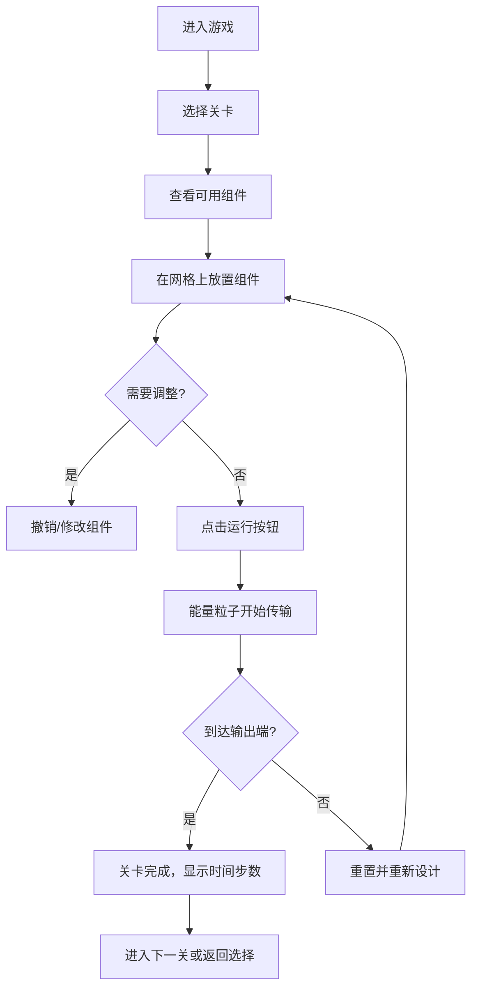
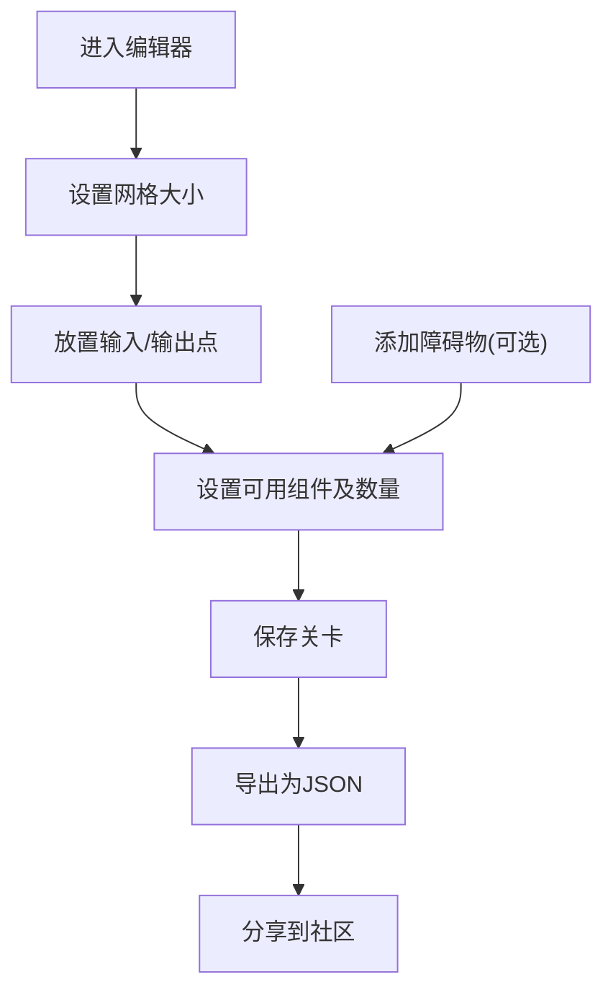

## 1. 产品概述

"蓝图"是一款基于网格的解谜游戏，玩家通过放置不同功能的组件（管道、齿轮、传送带、探测器）搭建能量传输路径，将输入端的能量成功传递到输出端以触发开关。游戏融合了逻辑思考和创造力，支持自定义关卡设计和社区分享。

### 核心价值
- 提供益智解谜体验，锻炼玩家的空间思维和逻辑推理能力
- 支持关卡编辑器，让玩家可以创造和分享自己的关卡
- 通过能量粒子动画展示传输过程，提供直观的视觉反馈

---

## 2. 核心功能

### 2.1 用户角色
| 角色 | 登录方式 | 核心权限 |
|------|----------|----------|
| 玩家 | 无需登录 | 游玩预设关卡、使用关卡编辑器、导入/导出关卡 |

### 2.2 功能模块
1. **游戏主界面**：网格画板、组件选择栏、控制面板
2. **关卡系统**：多关卡选择、关卡进度保存
3. **模拟运行系统**：能量粒子动画、路径显示、时间步数统计
4. **关卡编辑器**：自定义关卡设计、组件配置
5. **导入导出系统**：JSON格式关卡数据导入导出、社区关卡导入

### 2.3 页面详情
| 页面名称 | 模块名称 | 功能描述 |
|----------|----------|----------|
| 游戏主界面 | 网格画板 | 显示游戏网格，支持组件放置和交互 |
| 游戏主界面 | 组件选择栏 | 显示可用组件及剩余数量，支持拖拽或点击选择 |
| 游戏主界面 | 控制面板 | 运行/暂停/重置按钮、撤销/重做按钮、时间步数显示 |
| 关卡选择界面 | 关卡列表 | 显示所有预设关卡，支持点击进入 |
| 关卡编辑器 | 编辑面板 | 设置输入输出位置、组件数量限制、网格大小 |
| 关卡编辑器 | 工具栏 | 保存、导出、测试按钮 |
| 导入界面 | 导入面板 | 粘贴JSON数据导入社区关卡 |

---

## 3. 核心流程

---

## 4. 用户界面设计

### 4.1 设计风格
- **主色调**：深蓝色蓝图背景 (#0a192f)，搭配科技感的青蓝色 (#64ffda) 作为能量色
- **辅助色**：橙色 (#ff9f1c) 用于齿轮，绿色 (#2ecc71) 用于探测器，紫色 (#9b59b6) 用于传送带
- **按钮风格**：扁平化设计，悬停时有发光效果，圆角4px
- **字体**：使用 'JetBrains Mono' 等宽字体作为主字体，营造工程蓝图的氛围
- **布局风格**：三栏布局，左侧组件栏、中间网格区、右侧控制面板
- **视觉效果**：网格线使用细虚线，组件放置时带有半透明预览，能量粒子有发光拖尾效果

### 4.2 页面设计概述
| 页面名称 | 模块名称 | UI元素 |
|----------|----------|--------|
| 游戏主界面 | 网格画板 | 虚线网格、高亮单元格、组件渲染、输入/输出标记、能量粒子动画 |
| 游戏主界面 | 组件选择栏 | 组件图标、名称、剩余数量徽章、选中状态高亮 |
| 游戏主界面 | 控制面板 | 功能按钮组、时间步数显示器、关卡信息面板 |
| 关卡选择界面 | 关卡列表 | 关卡卡片、完成状态标记、难度星级 |
| 关卡编辑器 | 编辑面板 | 数值输入框、开关控件、颜色选择器 |

### 4.3 响应式设计
- 采用桌面优先设计，在小屏幕设备上自动调整为上下布局
- 组件栏在移动端可折叠
- 触摸设备优化组件放置操作，支持长按删除

---

## 5. 组件系统设计

### 5.1 组件类型及属性
| 组件类型 | 图标 | 属性 | 功能描述 |
|----------|------|------|----------|
| 直管 | ━ | 可旋转(0°/90°) | 直线传递能量 |
| 弯管 | ┓ | 可旋转(0°/90°/180°/270°) | 90度拐弯传递能量 |
| 齿轮 | ⚙ | 可旋转(顺时针/逆时针) | 改变能量传输方向90度 |
| 传送带 | ➡ | 可旋转(0°/90°/180°/270°)、延迟步数 | 延迟能量传输时间 |
| 探测器 | ◉ | 固定方向 | 检测能量通过，可触发特殊逻辑 |
| 十字管 | ╋ | 不可旋转 | 四通管道，能量可向多方向传输 |

### 5.2 能量传输规则
- 能量粒子每时间步移动一格
- 管道类组件决定能量可以从哪些方向进出
- 齿轮会将能量旋转90度（顺时针或逆时针取决于齿轮类型）
- 传送带会使能量在其上停留指定的延迟步数后继续传输
- 当能量到达输出端时，游戏结束并显示所用时间步数

---

## 6. 关卡数据结构

每个关卡以JSON格式存储，包含以下字段：
- `id`: 关卡唯一标识
- `name`: 关卡名称
- `difficulty`: 难度等级 (1-5星)
- `gridSize`: 网格大小 {width, height}
- `input`: 输入端位置和方向 {x, y, direction}
- `output`: 输出端位置 {x, y}
- `obstacles`: 障碍物位置数组
- `availableComponents`: 可用组件及数量限制
- `hint`: 关卡提示信息
