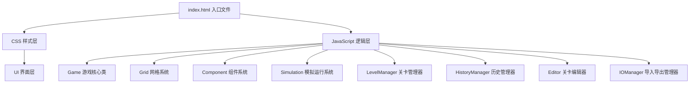

## 1. 架构设计



---

## 2. 技术栈说明

根据用户需求，采用纯前端原生技术栈，无需构建工具和框架：

- **HTML5**：页面结构、Canvas绘图、语义化标签
- **CSS3**：Flexbox/Grid布局、CSS变量、动画、渐变、响应式媒体查询
- **原生JavaScript (ES6+)**：模块化Class、事件系统、Canvas API、localStorage持久化
- **存储**：localStorage 存储关卡进度和自定义关卡
- **字体**：Google Fonts - JetBrains Mono

### 项目初始化方式
由于用户明确要求使用原生HTML/CSS/JavaScript，不使用框架，因此采用手动创建文件结构的方式，而非Vite脚手架。

---

## 3. 文件结构

```
.
├── index.html              # 主入口文件
├── css/
│   ├── style.css           # 主样式文件
│   ├── grid.css            # 网格系统样式
│   ├── components.css      # 组件样式
│   ├── animations.css      # 动画定义
│   └── responsive.css      # 响应式样式
├── js/
│   ├── main.js             # 入口脚本
│   ├── Game.js             # 游戏核心类
│   ├── Grid.js             # 网格系统
│   ├── Component.js        # 组件基类及子类
│   ├── Simulation.js       # 模拟运行系统
│   ├── LevelManager.js     # 关卡管理器
│   ├── HistoryManager.js   # 撤销/重做历史管理
│   ├── Editor.js           # 关卡编辑器
│   ├── IOManager.js        # 导入导出管理
│   ├── Particle.js         # 能量粒子类
│   ├── levels.js           # 预设关卡数据
│   └── utils.js            # 工具函数
└── assets/
    └── icons/              # 图标资源(如需要)
```

---

## 4. 核心类设计

### 4.1 Game 类
游戏核心控制器，协调各个模块：
```javascript
class Game {
  constructor()
  init()                    // 初始化游戏
  loadLevel(levelId)        // 加载关卡
  placeComponent(x, y, type, rotation)  // 放置组件
  removeComponent(x, y)     // 移除组件
  startSimulation()         // 开始模拟
  pauseSimulation()         // 暂停模拟
  resetLevel()              // 重置关卡
  undo()                    // 撤销
  redo()                    // 重做
}
```

### 4.2 Grid 类
网格系统管理：
```javascript
class Grid {
  constructor(width, height)
  getCell(x, y)             // 获取单元格
  setCell(x, y, component)  // 设置单元格
  isEmpty(x, y)             // 检查是否为空
  isValidPosition(x, y)     // 检查是否为有效位置
  render(ctx)               // 渲染网格
}
```

### 4.3 Component 类及其子类
组件系统采用继承设计：
```javascript
class Component {
  constructor(type, rotation, x, y)
  canEnter(direction)       // 是否可以从某方向进入
  getExitDirection(enterDir) // 获取出口方向
  getDelay()                // 获取延迟步数
  render(ctx, cellSize)     // 渲染组件
  rotate()                  // 旋转组件
}

class StraightPipe extends Component { }   // 直管
class ElbowPipe extends Component { }      // 弯管
class CrossPipe extends Component { }      // 十字管
class Gear extends Component { }           // 齿轮
class Conveyor extends Component { }       // 传送带
class Detector extends Component { }       // 探测器
```

### 4.4 Simulation 类
模拟运行系统：
```javascript
class Simulation {
  constructor(grid, input, output)
  start()
  pause()
  reset()
  step()                    // 执行一个时间步
  isComplete()              // 检查是否完成
  getTimeSteps()            // 获取已用时间步数
  getParticles()            // 获取所有粒子
  onComplete(callback)      // 完成回调
}
```

### 4.5 Particle 类
能量粒子：
```javascript
class Particle {
  constructor(x, y, direction)
  update()                  // 更新位置
  render(ctx, cellSize)     // 渲染粒子
  getPosition()
  getDirection()
}
```

### 4.6 HistoryManager 类
撤销/重做管理：
```javascript
class HistoryManager {
  constructor()
  push(state)               // 保存状态
  undo()                    // 撤销
  redo()                    // 重做
  canUndo()
  canRedo()
  getCurrentState()
}
```

### 4.7 LevelManager 类
关卡管理：
```javascript
class LevelManager {
  constructor()
  getLevels()               // 获取所有关卡
  getLevel(id)              // 获取指定关卡
  saveCustomLevel(level)    // 保存自定义关卡
  getCustomLevels()         // 获取自定义关卡
  completeLevel(id, steps)  // 标记关卡完成
}
```

### 4.8 IOManager 类
导入导出管理：
```javascript
class IOManager {
  exportLevel(level)        // 导出关卡为JSON
  importLevel(jsonString)   // 从JSON导入关卡
  validateLevel(level)      // 验证关卡数据
}
```

---

## 5. 数据模型

### 5.1 方向常量
```javascript
const DIRECTIONS = {
  UP: 0,
  RIGHT: 1,
  DOWN: 2,
  LEFT: 3
}
```

### 5.2 组件类型
```javascript
const COMPONENT_TYPES = {
  STRAIGHT_PIPE: 'straight',
  ELBOW_PIPE: 'elbow',
  CROSS_PIPE: 'cross',
  GEAR_CW: 'gear_cw',      // 顺时针齿轮
  GEAR_CCW: 'gear_ccw',    // 逆时针齿轮
  CONVEYOR: 'conveyor',
  DETECTOR: 'detector',
  INPUT: 'input',
  OUTPUT: 'output',
  OBSTACLE: 'obstacle'
}
```

### 5.3 关卡数据结构
```typescript
interface Level {
  id: string
  name: string
  difficulty: 1 | 2 | 3 | 4 | 5
  gridSize: {
    width: number
    height: number
  }
  input: {
    x: number
    y: number
    direction: number  // 0-3
  }
  output: {
    x: number
    y: number
  }
  obstacles: Array<{ x: number; y: number }>
  availableComponents: {
    [componentType: string]: number
  }
  hint?: string
  isCustom?: boolean
}
```

### 5.4 游戏状态
```typescript
interface GameState {
  level: Level | null
  grid: Array<Array<Component | null>>
  placedComponents: Array<Component>
  remainingComponents: {
    [componentType: string]: number
  }
  timeSteps: number
  isSimulating: boolean
  isComplete: boolean
}
```

### 5.5 历史状态快照
```typescript
interface HistoryState {
  grid: Array<Array<Component | null>>
  remainingComponents: {
    [componentType: string]: number
  }
}
```

---

## 6. 渲染系统

### 6.1 Canvas 渲染流程
1. 清空画布
2. 绘制网格背景和网格线
3. 绘制输入/输出端标记
4. 绘制障碍物
5. 绘制所有已放置的组件
6. 如果正在模拟，绘制能量粒子和路径轨迹
7. 绘制选中高亮和放置预览

### 6.2 渲染性能优化
- 使用离屏Canvas预渲染静态元素
- 只在需要时重绘（组件变化、模拟步进时）
- 使用 `requestAnimationFrame` 进行动画循环

---

## 7. 事件系统

### 7.1 鼠标事件
- `mousedown`: 选中组件
- `mousemove`: 拖动组件、显示放置预览
- `mouseup`: 放置组件
- `click`: 旋转组件（单击已有组件）
- `contextmenu`: 删除组件（右键）
- `mousewheel`: 旋转选中组件

### 7.2 键盘事件
- `R`: 旋转选中组件
- `Delete/Backspace`: 删除选中组件
- `Ctrl+Z`: 撤销
- `Ctrl+Y`: 重做
- `Space`: 开始/暂停模拟
- `Escape`: 取消当前操作

---

## 8. 本地存储

使用 `localStorage` 存储以下数据：
1. 关卡完成进度 `blueprint_progress`
2. 自定义关卡 `blueprint_custom_levels`
3. 用户偏好设置 `blueprint_settings`

---

## 9. 预设关卡设计

设计10个预设关卡，难度递进：
1. **入门** - 直管连接，学习基础操作
2. **拐弯** - 学习使用弯管
3. **双路径** - 学习使用十字管
4. **齿轮转向** - 学习使用齿轮改变方向
5. **传送带延时** - 学习使用传送带控制时间
6. **组合应用** - 综合使用多种组件
7. **迷宫** - 在障碍物间找路径
8. **多分支** - 需要探测器选择正确路径
9. **时序控制** - 需要精确控制传送带延迟
10. **终极挑战** - 大型复杂关卡

---

## 10. 性能与兼容性

### 10.1 浏览器兼容性
- 支持所有现代浏览器（Chrome、Firefox、Safari、Edge）
- 使用 ES6+ 特性，不转译，不支持 IE

### 10.2 性能指标
- 初始加载 < 1s
- 模拟运行 60fps
- 支持最大网格 20x20
- 历史记录最多保存 50 步

---

## 11. 安全考虑

1. **JSON导入安全**：导入关卡时进行严格的数据验证，防止XSS攻击
2. **localStorage数据隔离**：使用前缀区分存储项
3. **用户输入过滤**：关卡名称等用户输入进行HTML转义
